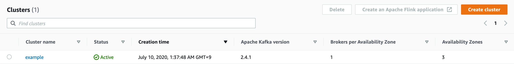

## Terraform script to set up the AWS MSK cluster

Features:
 - Region: us-east-2
 - Kafka version: 2.4.1
 - Three availability zones
 - Three broker nodes
 - Instances `kafka.t3.small`
 - Prometheus exporters available for brokers


## How to run

Install terraform CLI, for example with brew:

```
> brew install terraform
```

Next we will need to export env variables for authentication with AWS and run terraform.

```
> export AWS_ACCESS_KEY_ID=*********
> export AWS_SECRET_ACCESS_KEY=*********

> terraform plan
 (check output)

> terraform apply
```

## What output looks like

```
bootstrap_brokers_tls = b-2.example.6n6q8p.c3.kafka.us-east-2.amazonaws.com:9094,b-3.example.6n6q8p.c3.kafka.us-east-2.amazonaws.com:9094,b-1.example.6n6q8p.c3.kafka.us-east-2.amazonaws.com:9094
zookeeper_connect_string = z-3.example.6n6q8p.c3.kafka.us-east-2.amazonaws.com:2181,z-2.example.6n6q8p.c3.kafka.us-east-2.amazonaws.com:2181,z-1.example.6n6q8p.c3.kafka.us-east-2.amazonaws.com:2181
```

